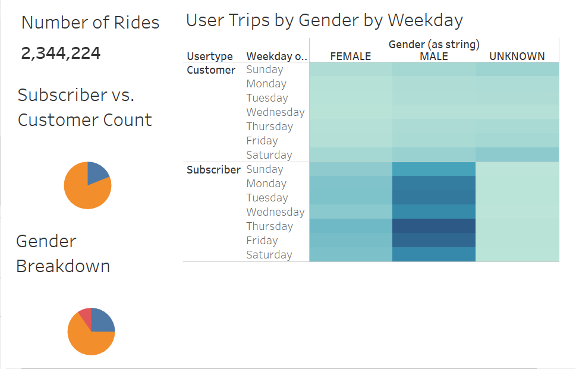
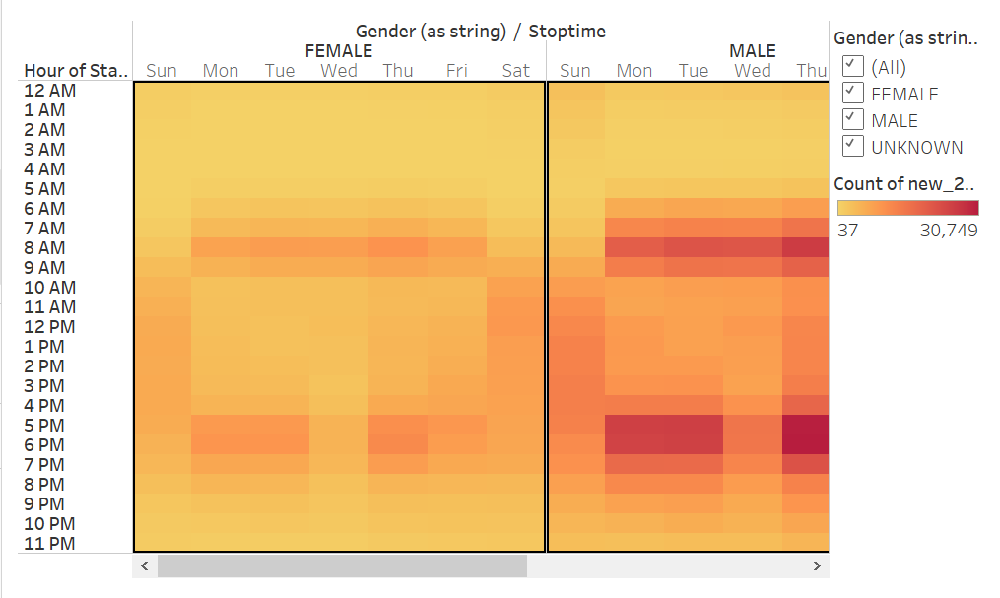
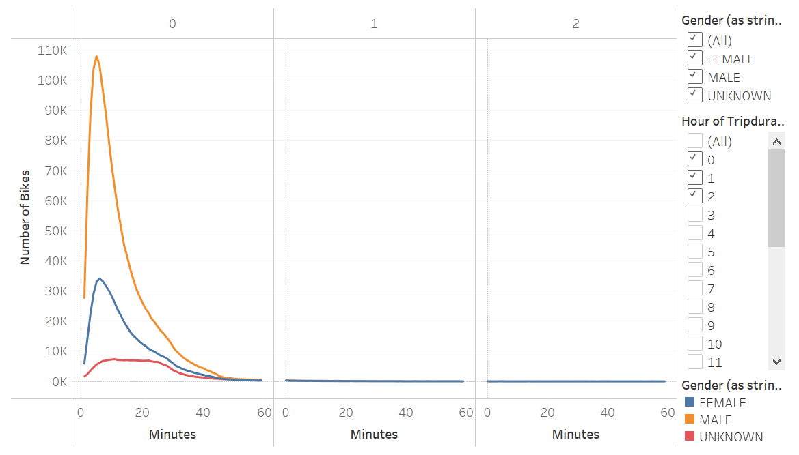

# bikesharing

## Overview of Citi Bike Analysis
We were tasked with creating a story using the NYC Citi Bike data to show a bike-sharing program is a solid business proposal. In order to accomplish this we will have to use pandas to create a new column that will highlight tripduration as datetime instead of an integer. Once that is complete we will complete our visualizations and story in Tableau.

## Results of Citi Bike Analysis
The NYC Bike City Tableau Story consists of 8 visualizations as a part of a 5 page story which can be found here: [Link to Dashboard](https://public.tableau.com/app/profile/trevor.iwen/viz/NYCBikeDataModule/NYCCitiBikeAnalysis?publish=yes)

### Subscriber and Gender Breakdown

This set of graphs shows the stronger subscriber presence in the NYC Citi Bike program using the gender breakdown and customer breakdown from the module as well as the User Trips by Gender by Weekday from the challenge. Subscribers made 81% of the rides in the NYC Bike Program. Subscribers are also more consistent users throughout the week. Breaking down the subscriber by gender it's clear male subscribers make up a majority of the program.

### Hourly Usage

This set of graphs show the hourly usage of bikes using the August Peak Hours from the module and the Trips by Weekday for Each Hour from the challenge. There's a very high usage of bikes during the week from 7-9am and 4-8pm. Saturday and Sunday usage is consistent throughout the day (9am-7pm). Peak Hours chart also highlights there is hourly usage during all 24 hours.

### Bike Checkout Duration

The Checkout Times for Users graph from the challenge shows that the duration of most trips are under 1 hour, with 5 minutes being the most frequent duration. Most trips are relatively short which could lower the amount of total bikes needed.

### Time of Day Usage by Gender

The Trips by Gender (Weekday per Hour) graph from the challenge expands from the hourly usage graph to show the time of day usage by gender. Both male and female show similar patterns in time of day usage being strongest during the week from 7-9am and 4-8pm, with weekends having consistent usage throughout the day. It's also clear the most usage comes from the male group during those peak weekday hours.

### Bike Checkout Duration by Gender

The Checkout Times by Gender graph from the challenge expands from the Bike Checkout Duration which shows the usage patterns do not change much between genders. Like most of the other visualizations it highlights the male group weighs heavily into the overall makeup of the Citi Bike data.

## Summary
### Conclusion of Results
With data presented for the NYC Citi Bike program for the month of August, there’s evidence to support a bike-sharing program could be a solid business proposal in Des Moines. Though they will need to establish a strong subscriber group and have bike availability in high traffic areas for not only tourists but also in areas with highest area employers. If Des Moines can support that, the data suggests strong usage across several hours each day of the week.

### Additional Visualizations
- The first additional visualization I would recommend is looking into age as a comparison to usage and subscriber status. Do customers' usage increase, decrease, or just shift as they age? What are the age’s of the subscribers? This could be done with a table and heatmap. It might be too much but this could overlay with gender as well.
- The second additional visualization I would recommend is bringing more months into comparison to see if this program could be sustainable for more months than August. 
- I would also try to incorporate some demographic and geographical information from Des Moines to see if the main subscriber demographic aligns with Des Moines and if they’re are certain areas that have relatively high traffic.

